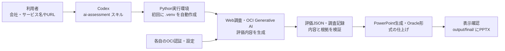

# AIアセスメント

会社・サービスの情報から、出典を確認したAIユースケース評価と、編集可能なPowerPoint（PPTX）を作成します。入口はこのリポジトリに同梱したCodexの [`ai-assessment` スキル](.agents/skills/ai-assessment/SKILL.md)です。別のPowerPointスキルをインストールする必要はありません。

## 全体の流れ



## 初めて使うとき

1. **準備する**：Codex、Python 3.12以降、利用可能なOCI Generative AI環境を用意します。Pythonの依存パッケージは次の手順で自動導入します。
2. **取得する**：`git clone https://github.com/masa-ishikawa/ai-assessment.git` を実行し、できた `ai-assessment` フォルダをCodexで開きます。リポジトリ内のスキルがそのまま使えます。
3. **OCIを設定する**：下の「手作業で必要なOCI設定」を済ませます。
4. **依頼する**：Codexに「`$ai-assessment` を使って、○○社の○○サービスをAI assessして」と伝えます。公式URLや既存のExcel・テキスト入力も渡せます。初回実行時に `.venv` が作られ、必要なPythonパッケージが入ります。

環境だけ先に作る場合は、リポジトリのルートで次を実行します。

| macOS | Windows PowerShell |
| --- | --- |
| `python3 scripts/run_assessment.py setup` | `py -3.12 scripts\run_assessment.py setup` |

## 手作業で必要なOCI設定

**ローカルPCから実行する場合、次の4点が必要です。**

1. **OCI API署名用の認証情報**：OCIユーザーのAPIキーを用意し、`~/.oci/config` にテナンシーOCID、ユーザーOCID、フィンガープリント、リージョン、秘密鍵ファイルのパスを設定します。既定のプロファイルは `DEFAULT` です。秘密鍵と設定ファイルはGitHubへ登録しないでください。
2. **Generative AI Project OCID**：OCIの対象プロジェクトのOCID。
3. **リージョン**：そのプロジェクトと利用モデルが使えるOCIリージョン名（例：`us-chicago-1`）。
4. **モデルID**：そのプロジェクトで利用できるResponses API対応モデルのID。

2〜4は、リポジトリのルートで `assessment_config.example.py` を `assessment_config.py` にコピーし、次の3項目を記入するのが簡単です。`assessment_config.py` はGit管理の対象外です。

```python
OCI_GENAI_PROJECT_OCID = "ocid1.generativeaiproject..."
OCI_REGION = "us-chicago-1"
GENAI_MODEL_ID = "利用するモデルID"
```

コピーするコマンドはmacOSでは `cp assessment_config.example.py assessment_config.py`、Windows PowerShellでは `Copy-Item assessment_config.example.py assessment_config.py` です。認証プロファイルが `DEFAULT` 以外なら、同じファイルの `OCI_PROFILE` も変更してください。

OCI側では、このユーザーに対象プロジェクトとモデルを利用できる権限が必要です。既定の `oci_responses` 経路では、**コンパートメントOCIDやOpenAI APIキーの記入は不要**です。OCI上でResource Principal認証を使う場合は、ローカルPCのAPIキー設定に代えて実行環境の認証と権限を用意します。

## 出力と補足

スキルがWeb調査、評価JSONの検証、PPTX生成と表示確認を進めます。完成したPPTXは `output/final/`、評価JSONは `output/json/`、調査記録は `output/research/` に保存します。PowerPointなどで最終表示を確認できます。

手動CLI、コンテナ実行、入力形式の詳細は [`scripts/run_assessment.py`](scripts/run_assessment.py)、[`Containerfile`](Containerfile)、[入力テンプレート](assessment_inputs/ISV_AI_Use_Case_Assessment_Input_Template.xlsx)を参照してください。`old/` は過去の資料の保管場所で、通常の生成には使いません。
